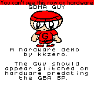
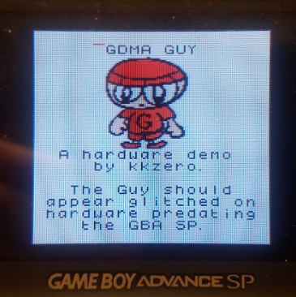

# GDMA Guy
**GDMA Guy** is a GBC hardware demo that initiates a General DMA transfer every frame, outside of VBlank.

 

This would typically be considered Doing It Wrong, but there's a reason I decided to demonstrate such--on hardware, the effects differ depending on which one you're using. 
* In double speed mode, the GBC and original GBA display serious graphical garbage on the transferred data, whereas the GBA SP displays very little artifacting, if any. Single speed has glitching regardless.
* Also, on any hardware, the first 8 scanlines are blanked out, something which doesn't happen on accurate emulators (BGB, Sameboy, Emulicious, etc.) at the time of writing. 
* Speaking of said emulators, Sameboy displays the Guy's glitching, whereas Emulicious and BGB don't.

I initially looked into this matter as a result of my work on [Faceball 2000 DX](https://www.romhacking.net/hacks/6107/), which has a variant that relies on GDMA to update the framebuffer.  It looked mostly fine on my AGS-101, but had severe graphical garbage on my GBC and original GBA. Sometime after releasing it, I looked through my code again, and found out that the garbages were a result of the second half of the framebuffer being forcibly updated right outside VBlank time. That put me in the mood to write a homebrew ROM that demonstrates this.

I feel this could be very beneficial to better understanding how the GBC hardware works. Enjoy!

# Things to figure out
* ~~The following hardware needs testing: AGS-001 and Game Boy Player.~~ Done, verified same as AGS-101 and CGB/AGB respectively.
* While the AGS-101 doesn't have the Guy's glitching, there's still a little red line that appears/disappears repeatedly next to the "G" in "GDMA". Any reason other than just artifacting? Why this out of everything else?

# Special Thanks
* ISSOtm, whose [GB ASM Tutorial](https://eldred.fr/gb-asm-tutorial/) gave me a lift in getting the code set up
* Jeremy Oduber for [Fonts for GB Studio](https://jeremyoduber.itch.io/fonts-for-gb-studio)
